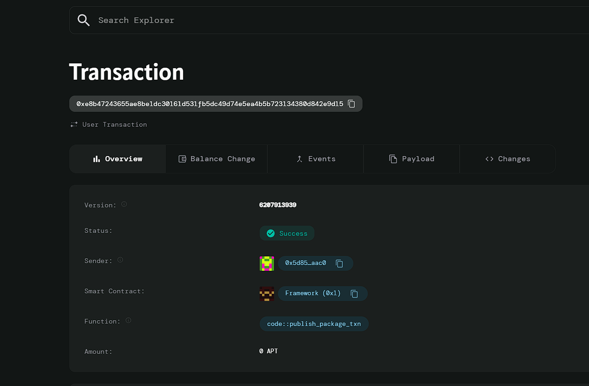

# Project07
# Rentable NFTs

# Deployed ID: 0xe8b47243655ae8be1dc30161d531fb5dc49d74e5ea4b5b723134380d842e9d15

## Project Description
The Rentable NFTs platform allows NFT owners to rent out their NFTs for a specific duration, enabling renters to access valuable digital assets without the need to purchase them. The smart contract facilitates the payment process, ensuring that owners receive their rental fees while maintaining control over the asset's rental period. This system provides a passive income opportunity for NFT owners and an affordable way for users to experience premium NFTs.

## Project Vision
The vision of this project is to unlock the potential of NFTs by creating a rental market, giving owners the ability to earn passive income from their assets while also providing access to those who cannot afford to buy them. By leveraging blockchain's transparency and security, this platform ensures that both parties, renters and owners, can engage in rental transactions with trust and confidence.

## Key Features
- **NFT Listing for Rent**: NFT owners can list their assets for rent by specifying the rental price and availability.
- **Rental Payment**: Renters can pay a specified amount of tokens to rent an NFT for a set duration, with payments directly sent to the owner.
- **Time-Limited Rentals**: The platform ensures that the NFT can only be rented for a specified period, after which it returns to its available state.
- **Transparent Transactions**: All transactions are recorded on the blockchain, ensuring transparency and security for both the renter and the owner.
